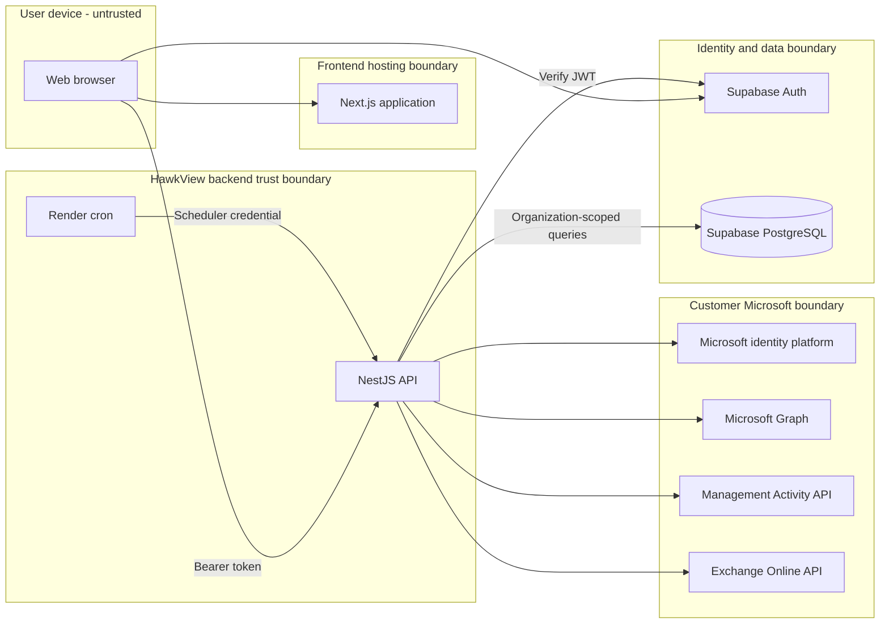
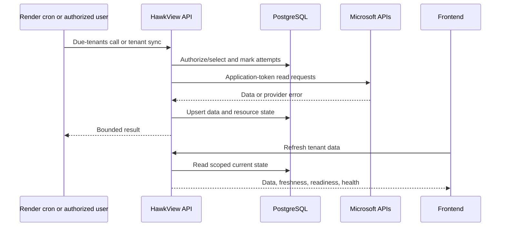

# HawkView

HawkView is a pilot software-as-a-service application for managed service providers (MSPs). It gives an MSP team one workspace in which to inspect multiple customers' Microsoft 365 environments. It collects read-only inventory, configuration, security, usage, sign-in, and administrative-change data, stores time-stamped observations, and turns them into dashboards, health signals, and investigation views.

This document describes verified behavior on the current `main` branch. A limitation or follow-up is not implemented.

## What HawkView does

HawkView currently:

- authenticates users with Supabase Auth email flows and requires multi-factor assurance (`aal2`) for protected API calls;
- creates an isolated MSP workspace for a direct sign-up, or links an invited user to its existing workspace;
- lets an MSP owner administer workspace settings and team membership;
- connects customer Microsoft tenants through a HawkView-managed or customer-managed application;
- collects data from Microsoft Graph, the Office 365 Management Activity API, and an optional restricted Exchange Online read-only path;
- stores snapshots, retained activity, synchronization state, collection readiness, and health history in PostgreSQL; and
- shows cross-customer dashboards and per-customer Entra, Microsoft 365, SharePoint, OneDrive, Exchange, DNS, activity, and change views.

HawkView does **not** currently:

- manage, remediate, or write customer Microsoft configuration;
- replace Microsoft 365, Entra, Purview, a SIEM, ticketing system, or backup product;
- guarantee every dataset for every Microsoft license or permission set;
- treat a scheduler heartbeat as proof that every resource refreshed;
- provide a complete product-wide audit trail for every HawkView action; or
- provide a supported broad-production service level. The operating model is pilot-grade.

## Glossary

| Term | Meaning in HawkView |
| --- | --- |
| **HawkView workspace** | The user-facing boundary containing one MSP organization, its members, and customers. The database model is `Organization`. |
| **MSP organization** | The durable record that owns memberships, customer tenants, settings, and workspace-administration audit records. |
| **Customer tenant** | A customer account inside an MSP organization. Its HawkView database ID differs from its Microsoft tenant ID. |
| **Microsoft tenant** | The customer's Microsoft Entra/Microsoft 365 directory, identified by Microsoft's tenant UUID. |
| **Member** | A HawkView user with a role-bearing membership in an MSP organization. Only active memberships authorize requests. |
| **Connector / collector** | A connector is stored application identity and consent. A collector is backend code that uses it to fetch a dataset. |
| **Snapshot** | A time-stamped stored observation. Most inventory keeps the latest observation; selected health and activity records retain history. |
| **Health** | Derived tenant/workload status based on connection, collection success/freshness, and selected evidence—not a Microsoft service-health guarantee. |
| **Audit event** | Either customer Microsoft activity collected from Microsoft, or selected HawkView workspace owner actions. There is not yet one complete HawkView audit stream. |

## System architecture



The browser is never trusted with a role, organization claim, database credential, Microsoft secret, or Supabase service-role key. `NEXT_PUBLIC_*` settings are public bundle inputs.

## Core data flow and trust boundaries

1. The browser establishes a session with Supabase Auth.
2. The frontend sends the access token to the API as `Authorization: Bearer ...`.
3. The API verifies the token and rejects anonymous, unconfirmed, disabled, or insufficient-assurance identities.
4. It resolves the verified provider subject to active database memberships; it does not accept a browser-supplied organization or role.
5. Tenant queries include organization ownership. Important relationships use `(customerTenantId, organizationId)`, and tests cover cross-organization rejection.
6. A connector obtains an application token for the exact Microsoft tenant. Collectors store results with organization and customer-tenant IDs plus per-resource state.
7. Frontend caches are scoped to identity and organization and cleared on identity transitions. This is defense in depth; backend authorization is authoritative.

### Sign-in and workspace authorization

```mermaid
sequenceDiagram
  actor User
  participant Web as Next.js frontend
  participant Auth as Supabase Auth
  participant API as HawkView API
  participant DB as PostgreSQL
  User->>Web: Sign in and complete MFA
  Web->>Auth: Email authentication
  Auth-->>Web: Confirmed AAL2 token
  Web->>API: POST /auth/bootstrap
  API->>Auth: Verify token
  API->>DB: Link subject; load memberships
  DB-->>API: Roles and organizations
  API-->>Web: Authorized workspace context
  Web->>API: Protected request
  API->>DB: Organization-scoped query
  API-->>Web: Scoped response
```

A direct first sign-in creates one organization and `MSP_OWNER` membership exactly once. An invitee is linked only to an explicit pending invitation. Workspace onboarding must finish before tenant onboarding.

### MSP onboarding and Microsoft tenant connection

```mermaid
sequenceDiagram
  actor MSP as MSP owner/admin/technician
  participant Web as Frontend
  participant API as HawkView API
  participant DB as PostgreSQL
  participant Login as Microsoft identity platform
  participant Graph as Microsoft Graph
  MSP->>Web: Choose connector mode
  Web->>API: Start onboarding
  API->>DB: Verify role; store pending tenant
  API-->>Web: Signed one-use consent URL
  actor Admin as Customer Microsoft admin
  Admin->>Login: Grant application consent
  Login->>API: Consent callback with state
  API->>Login: Acquire tenant token
  API->>Graph: Verify organization and grants
  API->>DB: Store state and encrypted credential reference
  API-->>Web: Return to resumable onboarding
```

Owners, admins, and technicians can onboard tenants after MSP setup; owners and admins can remove one. `HAWKVIEW_MANAGED` uses the platform connector. `CUSTOMER_MANAGED` validates and encrypts a customer-owned application credential. Consent state expires after 15 minutes and is single-use. Optional Exchange setup is separate and requires a Microsoft administrator to apply restricted RBAC.

### Scheduled/manual collection and dashboard refresh



Render provides a five-minute recovery heartbeat, not a five-minute promise for every dataset. Microsoft 365 Management Activity normally polls every 15 minutes when caught up and drains bounded backlog work. Failed, stale, unlicensed, unsupported, and permission-blocked data remains explicit.

### Team invitation and account setup

```mermaid
sequenceDiagram
  actor Owner as MSP owner
  participant Web as Frontend
  participant API as HawkView API
  participant DB as PostgreSQL
  participant Auth as Supabase Auth
  actor Member as Invitee
  Owner->>API: Invite email and role
  API->>DB: Verify owner; create pending member
  API->>Auth: Send fixed-destination invite
  API->>DB: Record invite outcome
  Auth-->>Member: Invitation email
  Member->>Auth: Accept, set password, enroll MFA
  Member->>API: Bootstrap with AAL2 token
  API->>DB: Claim exact pending invite
  API-->>Web: Workspace context
```

Only active owners manage members. Safety rules prevent self-removal and removal of the last active owner. Invitation delivery is rate-limited and provider errors are normalized.

## Repository structure

| Path | Responsibility |
| --- | --- |
| `app/` | Next.js App Router public authentication and protected product pages. |
| `components/` | Shared React product, layout, auth, tenant, and UI components. |
| `lib/` | API/Supabase clients, cache isolation, config validation, normalization, and frontend domain logic. |
| `types/`, `src/types/` | Frontend/API types and declarations. |
| `backend/src/` | NestJS auth, workspace, tenant, collection, Microsoft, change, notification, secret, canary, and health modules. |
| `backend/prisma/` | Schema, ordered PostgreSQL migrations, and development seed. |
| `backend/scripts/` | Database, GeoLite, and scheduled-sync utilities. |
| `docs/` | Focused engineering and operating notes; see [roadmap](docs/README.md). |
| `supabase/email-templates/` | Versioned authentication email templates and tests. |
| `.github/workflows/` | Pull-request and post-deployment checks. |
| `brand/`, `public/brand/` | Source and web brand assets. |
| `render.yaml` | Render API and cron blueprint. |

`attached_assets/`, `replit.md`, and `HAWKVIEW_PM.md` are historical inputs/continuity notes. Code, tests, migrations, scripts, and deployment descriptors remain authoritative.

## Technology stack and dependencies

| Area | Verified implementation |
| --- | --- |
| Frontend | Next.js 14 App Router, React 18, TypeScript, Tailwind, Radix UI, TanStack Query, Zod, MapLibre, Lucide |
| Backend | Node.js 22, NestJS 11, Express adapter, TypeScript, Prisma 7, JOSE, esbuild |
| Identity/data | Supabase Auth and Supabase-hosted PostgreSQL; CI uses PostgreSQL 16 |
| Microsoft | Identity platform, Microsoft Graph, Office 365 Management Activity, optional Exchange Online Admin API |
| Hosting | Independently published Google AI Studio frontend; Render API/cron; Supabase auth/database |
| Optional | MaxMind GeoLite2 City for limited-license sign-in location enrichment |
| CI/CD | GitHub Actions quality gates; Render `main` auto-deployment and exact-revision API smoke check |

There is no repository-owned frontend deployment manifest. Backend deployment success does not prove that a matching frontend revision is live.

## Local development

### Prerequisites

- Node.js 22 and npm
- a PostgreSQL 16-compatible development database
- a non-production Supabase project for real authentication flows
- a Microsoft test tenant/application only for consent or collection
- Docker only for the backend container

Never point local tools, seeds, migrations, or tests at production or a customer tenant.

### Frontend

```bash
npm ci
cp .env.example .env.local
npm run dev
```

On PowerShell use `Copy-Item .env.example .env.local`. The frontend listens on `http://localhost:3000`.

### Backend

```bash
cd backend
npm ci
cp .env.example .env
npm run db:generate
npm run db:migrate:deploy
npm run dev
```

On PowerShell use `Copy-Item .env.example .env`. The API defaults to `http://localhost:8080`. Real auth requires matching Supabase projects; Microsoft/scheduler features need their server variables.

## Environment variables

`NEXT_PUBLIC_*` names are public. All others are server-only. Keep values in ignored files or encrypted host settings—never Git, chat, logs, screenshots, or issues.

### Frontend public

| Name | Requirement and purpose |
| --- | --- |
| `NEXT_PUBLIC_API_URL` | Required: HawkView API origin; no alternate API-base name is supported. |
| `NEXT_PUBLIC_SITE_URL` | Required: canonical frontend origin for stable links. |
| `NEXT_PUBLIC_SUPABASE_URL` | Required for sign-in: public Supabase origin. |
| `NEXT_PUBLIC_SUPABASE_PUBLISHABLE_KEY` | Required for sign-in: browser-safe key, never a service-role key. |

### Backend auth, data, and runtime

| Name | Requirement and purpose |
| --- | --- |
| `DATABASE_URL` | Required PostgreSQL connection; secret. |
| `SUPABASE_URL` | Required protected-API issuer/project origin. |
| `SUPABASE_SERVICE_ROLE_KEY` | Required for team admin/canary operations; server-only secret. |
| `FRONTEND_ORIGINS` | Required deployment CORS allowlist; never use `*`. |
| `FRONTEND_APP_URL` | Required Microsoft return-link origin. |
| `HAWKVIEW_AUTH_REDIRECT_URL` | Optional outside production; auth email confirmation destination. |
| `GAS_PREVIEW_PROJECT_NUMBER` | Optional narrow Google AI Studio preview-origin allowance. |
| `PORT` | Optional; defaults to `8080`. |
| `NODE_ENV` | Deployment-managed runtime mode. |
| `RENDER_GIT_COMMIT` | Render-managed revision for safe health output. |

### Microsoft and encryption

| Name | Requirement and purpose |
| --- | --- |
| `SECRET_ENCRYPTION_KEY` | Required for connector secrets; 32-byte AES-256-GCM master key. |
| `MICROSOFT_ADMIN_CONSENT_REDIRECT_URI` | Required outside pinned production behavior; consent callback. |
| `MICROSOFT_REQUIRED_PERMISSIONS` | Optional additive permission requirements; cannot remove defaults. |

### Scheduler, audit collector, and GeoIP

| Name | Requirement and purpose |
| --- | --- |
| `SCHEDULER_SHARED_SECRET` | Required for Render schedule; minimum 32 characters. |
| `SCHEDULER_TARGET_URL` | Optional HTTPS cron target override. |
| `SCHEDULER_OIDC_AUDIENCE`, `SCHEDULER_SERVICE_ACCOUNT_EMAIL` | Optional legacy Google scheduler compatibility. |
| `SCHEDULED_SYNC_BATCH_SIZE`, `SCHEDULED_SYNC_CANDIDATE_SCAN_LIMIT` | Optional selection bounds. |
| `M365_AUDIT_POLL_INTERVAL_MINUTES`, `M365_AUDIT_MAX_BLOBS_PER_RUN`, `M365_AUDIT_MAX_DOWNLOAD_MB_PER_RUN`, `M365_AUDIT_MAX_RUNTIME_SECONDS` | Optional Management Activity cadence/run bounds. |
| `M365_AUDIT_TENANT_DAILY_DOWNLOAD_MB`, `M365_AUDIT_DEPLOYMENT_DAILY_DOWNLOAD_MB`, `M365_AUDIT_TENANT_MONTHLY_DOWNLOAD_MB`, `M365_AUDIT_DEPLOYMENT_MONTHLY_DOWNLOAD_MB` | Optional download budgets. |
| `M365_AUDIT_TENANT_DAILY_RECORDS`, `M365_AUDIT_DEPLOYMENT_DAILY_RECORDS`, `M365_AUDIT_TENANT_MONTHLY_RECORDS`, `M365_AUDIT_DEPLOYMENT_MONTHLY_RECORDS` | Optional retained-record budgets. |
| `MAXMIND_LICENSE_KEY` | Optional GeoLite download secret. |
| `GEOIP_CITY_DATABASE_PATH` | Optional GeoLite database path. |

`HAWKVIEW_CANARY_ENABLED` plus eight `HAWKVIEW_CANARY_A_*` / `HAWKVIEW_CANARY_B_*` names configure optional synthetic backend fixtures. CI also reads `HAWKVIEW_AUTH_CANARY_ENABLED`. Never use real users, organizations, or tenants.

## Database and migrations

The Prisma [schema](backend/prisma/schema.prisma) and [migrations](backend/prisma/migrations/) live under `backend/`. The container applies committed migrations before API startup. CI applies all migrations to disposable PostgreSQL and runs isolation tests.

From `backend/`:

```bash
npm run db:generate
npm run db:validate
npm run db:migrate:dev -- --name descriptive_name
npm run db:migrate:deploy
npm run db:seed
npm run db:verify
npm run db:studio
```

Use `db:migrate:dev` only on disposable development data. Review SQL, commit schema and migration, and never rewrite a deployed migration or reset shared data.

## Commands and quality gates

Root scripts:

| Task | Exact script |
| --- | --- |
| Frontend development / production | `npm run dev` / `npm run start` |
| Lint / type check / build | `npm run lint` / `npm run typecheck` / `npm run build` |
| Notification test | `npm run test:notifications` |

There is no all-frontend-tests package script. CI discovers all `lib/**/*.test.ts`, runs them with `node --experimental-strip-types --test`, runs `node --test .github/scripts/authenticated-msp-canary.test.mjs`, then typechecks, lints, and builds.

Backend scripts (from `backend/`):

| Task | Exact script |
| --- | --- |
| Development / production | `npm run dev` / `npm run start` |
| Type check and production bundle | `npm run build` |
| Focused tests | `npm run test:tenant-health`, `npm run test:service-sync-freshness`, `npm run test:collection-field-state`, `npm run test:changes`, `npm run test:m365-audit`, `npm run test:auth-registrations`, `npm run test:sharepoint-contract` |

The backend has no lint, standalone typecheck, or all-tests script. CI discovers `backend/src/**/*.test.ts` and runs `tsx --test` after migrations. [.github/workflows/quality-gates.yml](.github/workflows/quality-gates.yml) is authoritative.

## Authentication, roles, authorization, and isolation

Supabase Auth owns sign-up, confirmation, sign-in, recovery, invitation acceptance, and TOTP MFA. The API verifies signature, issuer, authenticated role, confirmed non-anonymous identity, expiry, and AAL2. Health and the consent callback are public exceptions; canary issuance has separate OIDC protection.

| Role | Verified authority |
| --- | --- |
| `MSP_OWNER` | Workspace/team administration; tenant onboarding/removal; read access. Owner safety rules apply. |
| `MSP_ADMIN` | Tenant onboarding/removal and organization read access. |
| `MSP_TECHNICIAN` | Tenant onboarding, manual collection, and organization read access. |
| `MSP_VIEWER` | Organization read access and manual collection for an existing tenant. The current backend allows any active workspace member to refresh data. |
| `PLATFORM_ADMIN` | Separate platform role allowed to configure the platform Microsoft connector. |
| `PLATFORM_SUPPORT`, `STANDARD_USER` | No platform connector privilege; organization access still needs membership. |

React route gates are not security boundaries. Every endpoint must authorize from the verified subject and include organization scope. New tenant endpoints require negative cross-MSP tests.

## Microsoft permission and consent overview

Collectors use **application permissions** with client credentials. A customer administrator grants consent, but collectors do not use an MSP member's delegated Microsoft session. Grants are verified per resource.

Default Microsoft Graph permissions are `Organization.Read.All`, `User.Read.All`, `GroupMember.Read.All`, `Member.Read.Hidden`, `AuditLog.Read.All`, `IdentityRiskyUser.Read.All`, `Directory.Read.All`, `UserAuthenticationMethod.Read.All`, `Policy.Read.All`, `Policy.Read.AuthenticationMethod`, `Device.Read.All`, `RoleManagement.Read.Directory`, `Application.Read.All`, `Sites.Read.All`, `SharePointTenantSettings.Read.All`, `Reports.Read.All`, `ReportSettings.Read.All`, `MailboxSettings.Read`, and `SecurityEvents.Read.All`. The Office 365 Management APIs permission is `ActivityFeed.Read`.

`Exchange.ManageAsAppV2` is a separate opt-in, not baseline consent. HawkView activates it only after verifying custom Exchange RBAC limited to `Get-Mailbox`; code does not run `Set-`, `New-`, or `Remove-` cmdlets.

Core versus optional capability and license prerequisites are represented in a versioned code-owned contract. Readiness reports missing, unverified, unsupported, unlicensed, or failed datasets. The only user interactions are HawkView/Supabase authentication and the customer's administrator-consent screen; neither is delegated Microsoft collection.

## Deployment overview

- Current operations documentation identifies Google AI Studio as the independently published frontend. Public variables are build-time inputs.
- Render builds `backend/Dockerfile` from `main`, applies migrations, and hosts the API. A Render cron calls scheduled synchronization every five minutes.
- Supabase hosts Auth and PostgreSQL; Render does not host the database.
- GitHub Actions checks pull requests. A deployment-status workflow verifies exact API SHA and database schema. The two-MSP authenticated canary runs only when synthetic fixtures are explicitly enabled.

Do not infer frontend revision, cron success, collection success, or tenant health from API health. `render.yaml` currently declares a free API plan, unsuitable for a production SLA. See [backend deployment](docs/render-backend.md) and [release safety](docs/release-safety.md).

## Logging, audit history, and correlation

NestJS logs startup/collector failures. Microsoft failures retain a provider request ID when returned; selected health fields and stored Microsoft records expose correlation IDs. Health endpoints expose only safe status/revision/schema state.

Stored histories include workspace-owner administration records, Microsoft sign-ins and directory audits, bounded redacted Management Activity records, normalized change evidence, resource sync states, and health snapshots.

Current limitations:

- no general inbound request ID propagated end to end;
- not every HawkView API action creates a workspace audit record;
- product-wide auditability P0 is being developed separately and is **not live on current `main`**; and
- log retention, alert routing, and operator ownership are not fully specified here.

**Documentation follow-up:** after auditability P0 reaches `main`, add the planned audit-event catalog/runbook and update only verified coverage.

Troubleshoot with UTC time, authorized organization/customer-tenant identifiers, resource, attempt, safe error code, revision, and Microsoft request/correlation ID. Never paste tokens, credentials, raw payloads, customer content, or personal data into logs/tickets.

## Security and privacy rules

- Enforce least privilege. New Microsoft calls require an access-contract entry, permission/license classification, safe failures, and tests.
- Never log tokens, codes, secrets, keys, connection strings, authorization headers, or ordinary tenant content.
- Label customer data with organization and tenant IDs; authorize membership and add cross-MSP negative tests.
- Treat frontend state, parameters, email, display name, role, and tenant ID as untrusted.
- Encrypt connector credentials, keep secrets server-side, and never commit environment files.
- Return stable safe errors and sanitize minimum diagnostic detail.
- Use synthetic fixtures; never seed or screenshot real customer data.
- Never turn missing, stale, failed, unlicensed, or concealed data into healthy empty data.
- Review retention/raw payloads and bound storage, runtime, and downloads for new collectors.

## Common troubleshooting

| Symptom | Checks |
| --- | --- |
| Frontend configuration unavailable | Confirm all four public variables at build time and republish. |
| `Failed to fetch` | Check API origin/health, HTTPS, CORS allowlist, exact browser origin, and stale build variables. |
| Protected API returns 403 | Complete email confirmation and TOTP MFA/AAL2; confirm active user and membership. |
| Invitee sees new workspace setup | Inspect explicit pending-invite/bootstrap state; never manually relink an accepted identity by email. |
| Tenant missing/forbidden | Confirm current active membership and tenant ownership; never bypass organization scope. |
| Microsoft consent fails | Check tenant, mode, state age/use, exact callback, credential, admin decision, and resource grants. |
| Connected panel unavailable | Check readiness, license, exact permission, last attempt/success, and safe reason. |
| Sync does not refresh | Check role, connection, due selection/cadence, retry state, cron run, logs, and resource status. |
| Schema stale | Run `npm run db:migrate:deploy` from `backend/` in the correct environment; never `migrate dev` in production. |
| SharePoint names missing | Microsoft may conceal report identifiers; HawkView only reads this setting. |
| Exchange partial | Distinguish baseline Graph data from separate Exchange consent and `Get-Mailbox` RBAC. |

## Known pilot limitations and deferred work

- No repository-owned frontend manifest or automatic exact-frontend-revision proof.
- Render blueprint uses a free API plan; always-on capacity is deferred.
- Authenticated cross-MSP deployment canary is disabled pending approved synthetic setup.
- Auditability and request correlation are partial.
- Log/alert SLOs, incident ownership, recovery objectives, and backup/restore evidence need runbooks.
- Microsoft completeness varies by license, permission, API availability, privacy, throttling, and retention.
- Management Activity is intentionally budget-bounded, so busy tenants can show backlog.
- Optional Exchange access requires separate consent/RBAC.
- Platform operating procedures, privacy requests, data classification, and customer-facing retention docs are deferred.
- Package scripts lack all-test aliases; backend also lacks lint and standalone typecheck aliases.

Roadmap and branch-only work are intentionally absent from implemented behavior.

## Contribution workflow and definition of done

1. Start from current `origin/main` in an isolated branch/worktree.
2. Keep scope narrow and inspect adjacent code, tests, migrations, and contracts.
3. Test behavior, authorization, failures, and cross-MSP isolation. Boundary changes need real-PostgreSQL negative cases.
4. Generate/review forward migrations; never rewrite deployed migrations.
5. Microsoft changes must update the access contract, readiness/consent UI, privacy analysis, safe errors, and tests.
6. Run focused tests and full CI-equivalent frontend tests/typecheck/lint/build plus Prisma generate/validate/migrate, all backend tests, and backend build.
7. Scan logs/errors/docs for secrets, tenant content, real identifiers, and unsupported claims.
8. Update docs for setup, variables, commands, architecture, permissions, deployment, operations, or behavior changes.
9. State test evidence, migration/deployment implications, documentation impact, limitations, and actions not performed in the PR.

Done means implemented, backend-authorized, cross-MSP isolated, failure-honest, tested, buildable, documented, and reviewable. Merge, deployment, migration application, consent, synchronization, and production configuration remain separate authorized actions.

## Documentation map

- [Documentation roadmap](docs/README.md)
- [Frontend/API contract](docs/frontend-api-contract.md)
- [Microsoft Entra data](docs/ENTRA-DATA.md)
- [Tenant data inventory](docs/tenant-data-inventory.md)
- [Tenant health model](backend/docs/tenant-health-model.md)
- [Service sync freshness](backend/docs/service-sync-freshness.md)
- [Backend deployment](docs/render-backend.md)
- [Release safety](docs/release-safety.md)
- [Authentication email branding](docs/auth-email-branding.md)

Add links to proposed documents only after they exist.
