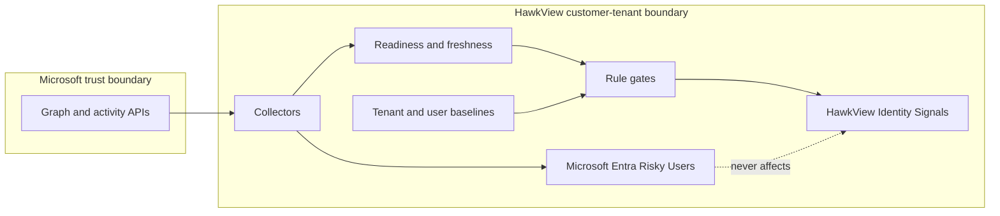
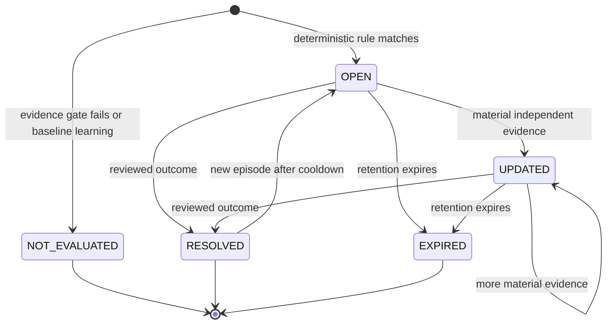

# HawkView identity risk engine v1

- Status: engineering specification; not implemented or customer-visible
- Decision date: 2026-09-02
- Source-code baseline: `778bdbaafd19c4378c95acf5d9e25d3cb98db7e4`
- Accountable owners: product and backend/security engineering
- Audience: product, backend, frontend, security, privacy, test, and operations engineers
- Review trigger: before each phase, and whenever the Microsoft access contract, normalized source schema, license rules, retention policy, privacy decision, or rule threshold changes

## Executive decision

HawkView should add a deterministic rule engine that turns evidence already collected by HawkView into explainable identity signals. Version 1 is rules, not machine learning. HawkView does not yet have enough calibrated, labelled customer data to train or validate a statistical model.

The product must always show two separate evidence channels with these exact customer-facing names:

- **HawkView Identity Signals**: investigation leads produced by HawkView rules.
- **Microsoft Entra Risky Users**: user-risk state reported by Microsoft Entra ID Protection.

These channels must never be merged, substituted, averaged, or used to change each other's score or state. A tenant without Microsoft Entra ID P2 can still receive HawkView findings from current directory, configuration, audit, change, and mailbox evidence. If current lawful sign-in evidence is unavailable, sign-in-dependent geographic, device, client, and authentication-behavior analysis is **Limited** and is not evaluated.

Every HawkView finding is an investigation lead. It is not proof that an account is compromised, and the product must never call a user safe. Version 1 does not take autonomous remediation actions.

Microsoft defines **user risk** as an estimate that an identity is compromised over time and **sign-in risk** as an estimate about one authentication. Microsoft publishes detector names, concepts, timing categories, license boundaries, and some qualitative descriptions. It does not publish reproducible model architecture, weights, full features, thresholds, exact windows, transformations, threat-intelligence lists, calibration, or error rates. HawkView must not claim Microsoft parity, reproduce Microsoft risk, or imply access to Microsoft's private threat intelligence. Microsoft describes risk as probabilistic and notes that some detections are calculated after authentication; its published risk levels reflect Microsoft's confidence, not a deterministic public formula ([Microsoft risk types and timing](https://learn.microsoft.com/en-us/entra/id-protection/concept-risk-detection-types), [Microsoft risk catalog](https://learn.microsoft.com/en-us/entra/id-protection/concept-identity-protection-risks), [Microsoft Identity Protection FAQ](https://learn.microsoft.com/en-us/entra/id-protection/id-protection-faq)).

Microsoft says details for detections described as real time can take roughly 5–10 minutes to appear, while offline detections can take up to 48 hours. HawkView therefore treats Microsoft risk as delayed provider evidence, not an instant ground truth and never a safe verdict when empty.

## Goals

- Detect a small, reviewable set of identity exposure and suspicious-change patterns from evidence HawkView already supports.
- Give each result stable rule identifiers, deterministic evaluation, plain-English explanations, source timestamps, freshness, confidence, and evidence coverage.
- Fail closed: missing, blocked, stale, malformed, partial, or capped required evidence produces `NOT_EVALUATED`, never a false result or a zero.
- Keep every read, write, cache key, replay, export, and deletion scoped by both MSP organization and customer tenant.
- Work for non-P2 tenants where broadly available evidence exists while stating reduced behavioral depth honestly.
- Support reproducible synthetic replay, shadow operation, human feedback, version rollback, and global or tenant kill switches.

## Non-goals

- No compromise verdict from one anomaly, posture weakness, or HawkView rule.
- No Microsoft Identity Protection clone, replacement, or parity claim.
- No autonomous account disablement, password reset, session revocation, policy change, or ticket closure.
- No leaked-credential, token-theft, AiTM, anomalous token/PRT, verified threat-actor IP, Microsoft threat-intelligence, or cross-tenant correlation claims without a separately approved lawful source.
- No Defender email/file signal or content claim without a separately approved connector, permission, privacy review, and source contract.
- No full SharePoint permissions or file-content analysis.
- No collection of passwords, password hashes, authentication secrets, MFA secrets, tokens, message bodies, file contents, or unnecessary raw provider payloads.
- No employee productivity monitoring, demographic inference, cross-customer baseline pooling, or customer data exposed to support by default.
- No public 0–100 probability in v1.

## Terms

- **Evidence**: a source record or saved snapshot used by a rule, with its source, event or observation time, ingestion time, freshness, and capability state.
- **Signal**: one versioned rule result for one human or non-human identity, mailbox, or identity-related object.
- **Finding**: a persisted, human-reviewable episode created from one signal or a bounded correlation of independent signal families.
- **Independent signal families**: evidence types whose errors are not merely repetitions of the same fact, such as a sign-in behavior followed by a directory privilege change.
- **Posture**: configuration or exposure that can increase harm but does not show malicious activity by itself.
- **Baseline**: tenant- and identity-scoped aggregates describing recurring expected behavior. A baseline is not a safe list.
- **Coverage**: `FULL`, `PARTIAL`, or `UNAVAILABLE` for the evidence required by a rule.
- **Freshness**: whether evidence is within the rule's declared maximum age.
- **Confidence**: `LOW`, `MEDIUM`, or `HIGH` confidence that the documented rule conditions were observed. It is not a probability of compromise.
- **Learning mode**: the period in which behavioral baselines are not mature enough for anomaly rules.
- **Microsoft-reported evidence**: Microsoft Entra risk data displayed as a separate channel without affecting HawkView results.

## Current HawkView capability boundary

The following describes code at the base commit of this specification. It is an input inventory, not a statement that the risk engine exists.

### Availability tiers

| Evidence group | Current source and HawkView resource | Permission and prerequisite | Intended v1 use | Capability display |
|---|---|---|---|---|
| Users, groups, devices, directory roles, applications, service principals | Microsoft Graph snapshots: `USERS`, `GROUPS`, `DEVICES`, `DIRECTORY_ROLES`, `APPLICATIONS`, `SERVICE_PRINCIPALS` | Application permissions named in the access contract; no Entra P2 prerequisite | Exposure, account lifecycle, privilege, guest, app, and directory-change rules | Broadly available when consent, collection, and freshness gates pass |
| Directory audit | Graph `/auditLogs/directoryAudits`; `AUDIT_LOGS` | `AuditLog.Read.All` and `Directory.Read.All`; no premium prerequisite in HawkView's contract | Identity lifecycle and privileged administrative change | Full only for current authoritative events |
| Microsoft 365 administrative audit | Office 365 Management Activity API; `M365_AUDIT` | `ActivityFeed.Read`, unified audit enabled; content and retention depend on tenant configuration and licensing | Cross-check and mailbox/administrative change evidence | Full, Partial, or Unavailable from collection state |
| Authentication posture | `AUTH_REGISTRATIONS`, `AUTH_METHOD_POLICIES`, `CONDITIONAL_ACCESS`, `SECURITY_DEFAULTS` | Per-user method fallback is broadly available; registration report and Conditional Access require P1/P2; Security Defaults does not | MFA exposure and protection context | Never infer enforcement from registration alone |
| Mailbox settings and inbox rules | Graph mailbox settings and inbox message rules; `EXCHANGE_MAILBOX_SETTINGS`, `EXCHANGE_MAILBOX_RULES` | `MailboxSettings.Read` plus Exchange service plan | External forwarding and suspicious rule configuration | Available only for mailboxes successfully covered |
| Full Graph sign-ins | Graph `/auditLogs/signIns`; `SIGN_INS` | `AuditLog.Read.All`, `Directory.Read.All`, and Entra ID P1 or P2 | Location, derived ASN, device, browser/client/app, failure/success, and legacy-auth rules; MFA-denial rules need a new allowlisted normalized detail | `FULL` only when current and structurally valid |
| Limited sign-in fallback | Office 365 Management Activity API login evidence; `SIGN_INS` | `ActivityFeed.Read` and unified audit enabled | Only rules whose exact required fields exist in the normalized fallback | Always `PARTIAL`; unsupported fields remain unavailable |
| Microsoft risky users | Graph `/identityProtection/riskyUsers`; `RISKY_USERS` | `IdentityRiskyUser.Read.All` and Entra ID P2 | Separate display-only Microsoft channel | `Microsoft Entra Risky Users`; unavailable is not zero |

### Free, P1, and P2 capability matrix

The Entra license does not grant API permission by itself. Every “Available” cell below still requires tenant-wide admin consent, a successful resource-specific collection, current evidence, and the rule's exact fields. Exchange and Microsoft 365 audit rows also require the named workload to be enabled.

| Evidence or feature | Free or no Entra premium | Entra ID P1 | Entra ID P2 | HawkView v1 decision |
|---|---|---|---|---|
| Directory inventory, roles, applications, service principals, and directory audit | Available with the access-contract permissions | Available | Available | Can support evidence-gated directory, privilege, app, and change signals at every tier |
| Per-user authentication-method types and Security Defaults | Available through the current fallback/policy sources | Available | Available | Posture context only; registration does not prove MFA enforcement |
| Authentication registration report and Conditional Access context | Not licensed for this source | Available | Available | Rules needing these sources return `NOT_EVALUATED` when the source is not licensed or current |
| Full Microsoft Graph sign-ins | Not licensed | Available, but Microsoft risk details can be hidden or limited | Available, including licensed risk details when returned | Full HawkView behavioral rules run only when every required normalized field is present |
| Limited sign-in fallback from Microsoft 365 audit | Possible only with `ActivityFeed.Read` and Unified Audit enabled | Same | Same | Always `PARTIAL`; each rule must explicitly allow the fields it uses |
| Microsoft Graph `riskDetections` | Not available | Limited Microsoft detections may be available | Available according to Microsoft licensing | Not collected by HawkView today; `IdentityRiskEvent.Read.All` is not in the current access contract |
| Microsoft Graph `riskyUsers` | Not licensed | Not licensed for this API | Available with `IdentityRiskyUser.Read.All` | Display only in **Microsoft Entra Risky Users**; never used by HawkView rules |
| Exchange mailbox settings and inbox rules | Depends on an Exchange service plan, not the Entra tier | Same | Same | Can support evidence-gated mailbox signals when coverage is authoritative |
| HawkView-native result | Directory/configuration/change/mailbox depth where prerequisites pass; sign-in behavior may be Partial or Unavailable | Adds Conditional Access and full sign-in depth where prerequisites pass | Same HawkView engine depth plus a separate Microsoft risky-user channel | License changes coverage, not the meaning or threshold of a HawkView rule |

Microsoft may expose generic or limited risk information below P2 while hiding details. Hidden, unavailable, delayed, or unlicensed Microsoft data is never converted to zero, “safe,” or a HawkView result.

The code-owned access truth is [`backend/src/microsoft/microsoft-access-contract.ts`](../backend/src/microsoft/microsoft-access-contract.ts). Collection truth, including `READY`, `STALE`, permission, licensing, and `CURRENT_LIMITED` states, is derived in [`backend/src/tenants/collection-readiness.ts`](../backend/src/tenants/collection-readiness.ts). Collection and normalization live in [`backend/src/tenants/tenant-sync.service.ts`](../backend/src/tenants/tenant-sync.service.ts). Effective MFA truth is derived in [`backend/src/tenants/effective-mfa-enforcement.ts`](../backend/src/tenants/effective-mfa-enforcement.ts); registered methods alone do not prove enforcement.

The Prisma schema already stores tenant-scoped snapshots and events in `TenantEntraSnapshot`, `SignInLog`, `DirectoryAuditLog`, `M365AuditRecord`, and `ChangeEvidenceEvent` ([`backend/prisma/schema.prisma`](../backend/prisma/schema.prisma)). Sign-in and administrative-event records currently expire after six calendar months in the collection service. A risk implementation should reuse source retention and persist only bounded derived evidence; it must not silently extend source retention.

| Current persisted source | What it proves for this design | Important limit |
|---|---|---|
| `DirectoryUser`, `DirectoryGroup`, `DirectoryGroupMembership`, `TenantLicense`, `TenantDomain` | Current tenant-local directory, membership, licensing, and verified-domain context | Current state does not by itself prove who changed it or why |
| `SyncState`, `TenantCollectionFieldState` | Attempt, success, error, and freshness evidence for a resource or field | A successful scheduler or connection is not proof that every resource succeeded |
| `TenantEntraSnapshot` | Current normalized snapshot for one resource type | It is not a general historical snapshot store; change rules need an authoritative event or separately retained comparable states |
| `SignInLog` | Normalized authentication event fields plus source retention | Some fields are absent in limited sources. MFA denial/timeout details are not a first-class normalized column today, and the existing `raw` value must not be copied wholesale |
| `DirectoryAuditLog`, `M365AuditRecord`, `ChangeEvidenceEvent` | Administrative/change events and normalized before/after evidence when Microsoft supplies it | Actor, target, outcome, or before/after values can be absent; absence must remain unknown |

HawkView does not currently have a durable service/shared/break-glass account classification. Service principals are non-human identities, not user accounts. Until an authorized tenant administrator classifies a human, service, shared, or break-glass account, rules that depend on that class return `NOT_EVALUATED` instead of guessing from a name or activity pattern.

### Evidence shape and exclusions

The engine may consume normalized fields that the current schema and collectors already expose, subject to readiness and freshness:

- user/account identifiers and lifecycle properties;
- guest/member and enabled/disabled state;
- current role assignments and directory audit changes;
- authentication registration and effective-enforcement projections;
- Conditional Access, Security Defaults, named-location, app, and service-principal snapshots;
- mailbox rule conditions and actions needed to identify forwarding, redirect, deletion, or concealment behavior;
- sign-in event time, success/failure, interactive state, app, IP, client app, location, and device details when present and permitted;
- Microsoft risky-user level, state, detail, and update time only in the separate Microsoft channel.

Any Microsoft-provided sign-in risk level, risk state, risk detail, risk event type, or risky-user field is Microsoft-reported evidence. It is excluded from every HawkView rule, baseline, severity, confidence, correlation, and performance metric even when the field is present in an existing normalized log.

The engine must not persist raw fields simply because a provider response contains them. In particular, exclude credentials, password hashes, credential material, tokens, cookies, MFA secrets, message or file content, arbitrary raw error bodies, and raw payload properties not required for a declared rule. Existing `raw` source columns are not permission to duplicate raw data into risk records.

Microsoft Graph sign-in objects include device, location, network, client, status, and authentication-related fields, but field availability and meaning vary ([Microsoft Graph sign-in resource](https://learn.microsoft.com/en-us/graph/api/resources/signin?view=graph-rest-1.0), [Microsoft sign-in detail limitations](https://learn.microsoft.com/en-us/entra/identity/monitoring-health/concept-sign-in-log-activity-details)). Microsoft retention also varies by license and report type, so collection gaps must remain visible ([current Microsoft Entra data-retention reference](https://learn.microsoft.com/en-us/entra/identity/monitoring-health/reference-reports-data-retention)). For this specification, that current retention reference is the source of record when older export or reporting pages conflict. HawkView's observed source expiry and its own approved retention policy remain the implementation boundary.

## Versioned signal catalog

Catalog version: `hawkview-identity-signals/v1`. Stable IDs never change meaning. A changed condition, evidence requirement, window, or severity creates a new rule version. Thresholds below are initial engineering constants to validate in synthetic and shadow evaluation; they are not proven field-performance values.

`HV-ID-EXP`, `HV-ID-CHG`, `HV-ID-APP`, and `HV-ID-MBX` rules can run for Free/non-premium, P1, or P2 tenants when their exact directory, policy, audit, app, domain, or mailbox evidence gates pass. `HV-ID-AUTH` rules and `HV-ID-EXP-003` require current sign-in fields and therefore usually need P1/P2 full Graph sign-ins; a limited fallback may run only a rule that explicitly proves all of its fields. `MS-ENTRA-RISKY-USER` is P2-only Microsoft display evidence, not a HawkView rule.

### Exposure and posture

| Stable ID | Rule | Required current evidence | Max evidence age | Result |
|---|---|---|---|---|
| `HV-ID-EXP-001.v1` | Privileged identity lacks verified effective MFA enforcement | Current user, current role assignment, and current effective-MFA projection | Directory/role/MFA snapshots: 36 hours | Medium exposure; never compromise |
| `HV-ID-EXP-002.v1` | Enabled privileged guest identity | Current user guest type and current privileged role assignment | 36 hours | Medium exposure; High only after an independent suspicious activity signal |
| `HV-ID-EXP-003.v1` | Enabled dormant privileged identity | Current user/role plus mature full sign-in baseline showing no successful interactive sign-in for 45 days | Directory: 36 hours; sign-ins: 2 hours | Medium exposure; not evaluated without full sign-ins |

`HV-ID-EXP-001.v1` must use the effective enforcement projection. Authentication-method registration by itself is insufficient. Posture rules never produce `confirmed compromise` and cannot alone create a Critical finding.

### Privileged and directory change

| Stable ID | Rule | Required current evidence | Max evidence age | Initial deterministic condition |
|---|---|---|---|---|
| `HV-ID-CHG-001.v1` | New or re-enabled identity followed by privilege | Authoritative user lifecycle change and successful role/group privilege change | Events: 24 hours old or less | Privilege assigned within 24 hours of create/re-enable; High |
| `HV-ID-CHG-002.v1` | Privileged guest or newly created identity | Authoritative guest state or user-create event plus role/group privilege change | Snapshot: 36 hours; event: 24 hours | Guest, or identity with an authoritative create event less than 7 days old, receives privilege; High |
| `HV-ID-CHG-003.v1` | Burst of privileged administrative changes | Successful directory/M365 audit events with actor and target | Events: 2 hours | At least 5 privilege, credential, consent, or security-policy changes by one actor in 15 minutes and above the mature tenant baseline; Medium, or High with a second independent family |
| `HV-ID-CHG-004.v1` | Unusual privileged change for actor | Successful audit events and mature actor/tenant baseline | Events: 2 hours; baseline inputs within retention | High-impact operation absent from actor baseline and rare in tenant baseline; Medium |
| `HV-ID-CHG-005.v1` | Identity protection was weakened | Successful audit evidence or two authoritative comparable states for Security Defaults, Conditional Access, or authentication-method policy | Event: 2 hours; snapshots: 36 hours | Security Defaults changed from enabled to disabled, an enabled MFA policy became report-only/disabled, or a strong grant was removed; High investigation lead, not compromise |

Role and group catalogs used to define privilege must be versioned. A write that fails or has an unknown result does not satisfy a successful-change rule. `DirectoryUser.firstSeenAt` means first observed by HawkView; it does not prove Microsoft account creation. Snapshot differences may support a finding only when both snapshots are authoritative and comparable; they must not invent actor attribution.

### Application and service-principal change

| Stable ID | Rule | Required current evidence | Max evidence age | Initial deterministic condition |
|---|---|---|---|---|
| `HV-ID-APP-001.v1` | New application declares high-impact permissions | Current authoritative application snapshot, prior absence or creation event, and versioned high-impact permission catalog | Snapshot: 36 hours; event: 24 hours | A newly observed application declares a permission in the approved high-impact catalog; Medium exposure |
| `HV-ID-APP-002.v1` | Application credential metadata changed | Two authoritative comparable application states or a successful audit event | Event: 2 hours; snapshots: 36 hours | Credential metadata was added or replaced for an application in the high-impact catalog; Medium, or High with an independent suspicious actor/change family |

`requiredResourceAccess` shows what an application declares; it does not prove that tenant-wide consent was granted. The current collector does not provide a complete OAuth grant inventory. Version 1 must not label an application “consented” or “active permission granted” from declared permissions alone. Credential rules retain only identifiers, type, and validity metadata needed for comparison—never secret text or private key material.

### Mailbox compromise indicators

| Stable ID | Rule | Required current evidence | Max evidence age | Initial deterministic condition |
|---|---|---|---|---|
| `HV-ID-MBX-001.v1` | Suspicious external forwarding or redirect | Current authoritative mailbox rule details and verified tenant domains | 36 hours | Enabled rule forwards or redirects to a recipient outside verified tenant domains; High investigation lead |
| `HV-ID-MBX-002.v1` | Suspicious concealment rule | Current authoritative mailbox rule details | 36 hours | An enabled rule broadly matches mail and combines delete/permanent-delete/move with mark-as-read or stop-processing actions; Medium exposure |
| `HV-ID-MBX-003.v1` | Mailbox rule change after suspicious authentication | A successful rule-change event or two comparable states plus an independent sign-in family result for the same identity | Rule change/sign-in correlation: 2 hours | Elevate episode priority one band, maximum Critical; still not a compromise verdict |

External-domain matching must normalize addresses and domains, handle accepted/verified domains, and expose uncertainty. HawkView does not inspect message bodies.

### Authentication and sign-in behavior

These rules run only when every named field is available in lawful, current evidence. `CURRENT_LIMITED` fallback is not automatically sufficient. Each rule declares whether the normalized fallback contains all required fields; otherwise it returns `NOT_EVALUATED` with `PARTIAL` coverage.

| Stable ID | Rule | Required evidence and max age | Initial deterministic condition |
|---|---|---|---|
| `HV-ID-AUTH-001.v1` | Disabled-account activity | Current disabled state (36 hours), authoritative disable time/event, and sign-in event (2 hours) | Authentication activity after the observed disable time; High if successful, Medium if failed |
| `HV-ID-AUTH-002.v1` | Dormant-account activity | Mature full sign-in baseline and event (2 hours) | Successful interactive sign-in after at least 45 days without one; Medium |
| `HV-ID-AUTH-003.v1` | Unfamiliar country, ASN, device, browser/client, or app | Full sign-in fields (2 hours) and mature user/tenant baseline | At least two unfamiliar property groups in one successful interactive sign-in; Medium. One property alone is Low/non-actionable |
| `HV-ID-AUTH-004.v1` | Atypical travel | Two full sign-ins (2 hours), reliable geolocation, mature baseline, suppression context | Required travel speed above 900 km/h and locations at least 500 km apart; suppress or lower for known VPN/NAT/mobile egress and common tenant egress; Medium |
| `HV-ID-AUTH-005.v1` | Failure burst followed by success | Sign-in status, actor, time, IP/ASN when available (2 hours) | At least 10 failures for one identity in 10 minutes followed by success within 15 minutes; Medium; High only with independent follow-on change |
| `HV-ID-AUTH-006.v1` | MFA-fatigue pattern | Full authentication detail/status sufficient to distinguish repeated MFA denial/timeout and later success (2 hours) | At least 3 MFA denials/timeouts in 10 minutes followed by success within 15 minutes; High investigation lead |
| `HV-ID-AUTH-007.v1` | Privileged legacy authentication | Current privilege snapshot (36 hours) and successful sign-in client/protocol evidence (2 hours) | Privileged identity successfully uses a configured legacy-auth client; High exposure/activity finding |
| `HV-ID-AUTH-008.v1` | Password-spray pattern followed by success | Complete tenant-wide sign-in failures/successes with actor, time, IP or derived ASN (2 hours) | One source produces at least 10 failures across at least 5 identities in 10 minutes, then succeeds for one targeted identity within 15 minutes; Medium, or High with an independent follow-on change |
| `HV-ID-AUTH-009.v1` | Unexpected break-glass account use | Explicit current break-glass classification, successful interactive sign-in (2 hours), and approved exercise/maintenance context | A designated break-glass account signs in interactively outside an approved expiring window; Critical investigation priority, but not a compromise verdict |

VPN, carrier NAT, mobile roaming, corporate egress, shared devices, service accounts, and expected travel are mandatory suppression inputs where applicable. Location, IP, device, time, app, or browser alone cannot produce High. A tenant-wide completeness gate is mandatory for spray detection; a truncated page or partial source returns `NOT_EVALUATED`.

Microsoft describes a minimum five-day learning period for unfamiliar sign-in properties and an atypical-travel learning period that ends after 14 days or 10 sign-ins, whichever happens first. These published concepts explain why cold-start protection matters; they are not HawkView thresholds and do not reveal Microsoft's algorithm. HawkView uses its own independently tested baseline rules below ([Microsoft risk catalog](https://learn.microsoft.com/en-us/entra/id-protection/concept-identity-protection-risks)).

### Microsoft-reported evidence: separate display channel

| Stable ID | Display rule | Required evidence | Behavior |
|---|---|---|---|
| `MS-ENTRA-RISKY-USER.v1` | Display a Microsoft Entra risky user | Current authoritative `RISKY_USERS` snapshot, P2 entitlement, and confirmed permission | Show under **Microsoft Entra Risky Users**, with Microsoft's state, level, detail, source, and update time |

This is not a HawkView signal and must not alter HawkView severity, confidence, episode state, baseline, ranking formula, or aggregate score. Missing Microsoft evidence is `Unavailable`, not zero. Preserve Microsoft's states without reinterpretation: `none`, `atRisk`, `remediated`, `dismissed`, `confirmedSafe`, `confirmedCompromised`, and `unknownFutureValue`. Microsoft Graph defines `riskyUser` independently and restricts the data by permissions and licensing ([list Microsoft Graph risky users](https://learn.microsoft.com/en-us/graph/api/riskyuser-list?view=graph-rest-1.0), [Microsoft Graph riskyUser resource](https://learn.microsoft.com/en-us/graph/api/resources/riskyuser?view=graph-rest-1.0), [Microsoft risky-user investigation and actions](https://learn.microsoft.com/en-us/entra/id-protection/concept-risky-user-report), [Microsoft Graph risk detections](https://learn.microsoft.com/en-us/graph/api/riskdetection-list?view=graph-rest-1.0)).

## Exact v1 evaluation algorithm

```text
evaluateTenant(orgId, tenantId, evaluationTime, engineVersion):
  assert orgId and tenantId are present
  assert engineVersion exists and is enabled for this tenant
  load capability/readiness evidence WHERE organizationId=orgId AND customerTenantId=tenantId
  load only rule-required source records using the same compound scope
  reject future-dated records outside the allowed clock-skew tolerance

  if global or tenant kill switch blocks customer alerts:
    continue deterministic evaluation and audit, but publish no customer alert

  for each enabled rule in catalog(engineVersion), in stable rule-ID order:
    required = rule.requiredEvidence
    gate = validate(required):
      source exists and belongs to orgId + tenantId
      readiness is authoritative for that dataset
      permission and license/applicability states satisfy the rule
      payload schema/version is supported and structurally valid
      source event/observation time is not in the future
      every item is within rule.maxAge
      coverage supplies every field named by the rule
      pagination/cap/truncation state is complete where the rule requires completeness

    if any gate fails:
      emit RuleResult(ruleId, NOT_EVALUATED, coverage,
        missingOrInvalidEvidence, observedAt=null, reasonCode)
      continue

    accountClass = loadExplicitAccountClass(orgId, tenantId, subjectId)
    if rule requires an account class and accountClass is unverified:
      emit RuleResult(ruleId, NOT_EVALUATED, coverage,
        reasonCode=ACCOUNT_CLASS_UNVERIFIED)
      continue

    baseline = loadBaseline(orgId, tenantId, subjectId,
      accountClass, rule.baselineVersion)
    if rule.requiresMatureBaseline and baseline is not MATURE:
      emit RuleResult(ruleId, NOT_EVALUATED, coverage,
        reasonCode=BASELINE_LEARNING)
      continue

    normalized = canonicalize(required records)
    matched = rule.evaluate(normalized, baseline, fixed rule constants)
    emit deterministic RuleResult with:
      MATCHED or NOT_MATCHED, severity, confidence, coverage,
      explanation, benignAlternatives, evidenceRefs, sourceTimes,
      maxAge, baselineMaturity, ruleVersion, engineVersion

  episodes = correlate only MATCHED results from independent families
    for the same orgId + tenantId + subject within each rule's bounded window
  privilege may elevate episode priority by one band
  posture alone cannot create confirmed compromise or Critical
  Critical normally requires at least two independent families;
    the approved unexpected-break-glass activity rule is the only v1 exception
  Microsoft-reported evidence is excluded from correlation and HawkView priority
  upsert findings by deterministic dedupe key
  audit evaluation, suppression, state change, and feedback metadata
```

Severity bands are `LOW`, `MEDIUM`, `HIGH`, and `CRITICAL`. They describe investigation priority, not compromise probability. `CRITICAL` requires at least two independent families, including a high-specificity activity or change signal, except for the explicitly classified unexpected break-glass activity rule. Posture alone cannot produce it. Confidence describes evidence and rule specificity: `HIGH` requires authoritative complete evidence and a high-specificity condition, `MEDIUM` permits bounded ambiguity, and `LOW` is contextual/non-actionable.

The dedupe key is a hash of `organizationId + customerTenantId + subjectType + subjectId + primaryRuleId + normalized episode bucket + engineVersion`. Reordered or duplicate source events must produce the same evidence IDs and finding.

## Finding lifecycle

- `OPEN`: a new matched episode requires review.
- `UPDATED`: new independent evidence materially changes an open finding's explanation, severity, confidence, or coverage. Repeated duplicate evidence does not update it.
- `RESOLVED`: an analyst records `authorized benign`, `false positive`, `remediated`, or `confirmed malicious`, with reason and time. Resolution never rewrites original evidence.
- `EXPIRED`: the finding's bounded evidence and policy retention expire without an active exception. Expiry is not a safe verdict.

Reappearance inside a rule-specific cooldown updates the same open episode unless independent new activity meets the reopen condition. After cooldown, it creates a new episode linked to the prior finding. Suppressions require organization, tenant, rule/subject scope, reason, creator, creation time, and mandatory expiry. Suppression stops customer alerting, not deterministic evaluation or immutable audit history. Broad permanent suppression is forbidden.

Human feedback states are `CONFIRMED_MALICIOUS`, `FALSE_POSITIVE`, `AUTHORIZED_BENIGN`, and `REMEDIATED`. A reviewer may also leave `INSUFFICIENT_EVIDENCE` without resolving. Only authorized security roles may submit feedback. Feedback is not automatically treated as training truth.

## Baseline design

Every baseline is scoped to `organizationId + customerTenantId`; user baselines add a stable tenant-local subject ID. Never pool behavior across MSPs or customer tenants. Separate baseline classes cover ordinary users, privileged administrators, service accounts, shared accounts, guests/new identities, and designated break-glass accounts.

Standard human-user behavioral rules remain in `LEARNING` until both conditions are satisfied:

- at least 7 active days containing eligible evidence; and
- at least 20 eligible successful interactive sign-ins.

Privileged human-user behavior requires at least 14 active days and 20 eligible successful interactive sign-ins. Service, shared, guest/new, and break-glass classes require separately approved rules; they do not inherit an ordinary-human baseline. The break-glass-use rule does not need a behavioral baseline, but it does need explicit current classification and approved exercise-window context.

These are conservative v1 product parameters, not proof of statistical sufficiency. Sparse accounts can remain in learning mode indefinitely. High-specificity directory and mailbox change rules that do not depend on a behavioral baseline continue to run during learning.

An unresolved suspicious episode does not immediately enter a baseline. A new property becomes a candidate only after recurrence on at least two separate UTC days without an unresolved finding, or after explicit analyst confirmation as authorized benign. Candidate promotion is deterministic and versioned. Confirmed malicious and false-positive evidence does not enter automatically; authorized benign evidence may accelerate only the specifically approved property and scope.

Store bounded aggregates or tenant-keyed hashes where possible: frequency counts, first/last observed time, coarse country, derived ASN, device/client/app fingerprints, and recurrence days. Avoid retaining raw IP addresses and user-agent strings in baseline storage. Baseline retention cannot exceed the underlying permitted evidence retention, and deletion of a customer tenant deletes its baselines and derived findings.

Poisoning resistance requires bounded per-day contribution, no single event promoting a candidate, exclusion of unresolved alert windows, versioned account classes, minimum recurrence across days, and monitoring for abrupt distribution shifts. Replay of the same source event must not increase a count. Changing a source schema, license tier, capability, or baseline version returns affected behavioral rules to learning rather than interpreting the change as normal behavior.

## Storage and API contract

Implementation requires new schema and endpoints; none are created by this document.

### Storage

Use immutable evidence references plus mutable workflow state:

- `IdentityRiskEvidence`: immutable normalized evidence reference, canonical hash, source type, source record identifier, source event/observation time, ingestion time, freshness decision, retained fields, expiry, rule and engine version.
- `IdentityRiskRuleResult`: immutable evaluation result including `MATCHED`, `NOT_MATCHED`, or `NOT_EVALUATED`, severity, confidence, coverage, explanation inputs, missing evidence, baseline maturity, and deterministic replay ID.
- `IdentityRiskFinding`: mutable current lifecycle state and current priority; links to immutable results.
- `IdentityRiskFindingHistory`: append-only state, suppression, feedback, assignment, and explanation changes.
- `IdentityRiskBaseline`: versioned bounded aggregates and maturity; no cross-tenant keys.
- `IdentityRiskSuppression`: expiring scoped exception with reason and audit metadata.

Every primary key, unique constraint, foreign key relationship, index used for retrieval, cache key, job payload, API query, replay, export, and delete must include or verify both `organizationId` and `customerTenantId`. Relations should use the existing compound tenant relationship pattern. A bare `customerTenantId`, Microsoft object ID, email, or user principal name is never sufficient authorization scope.

### API

All endpoints require the existing authenticated workspace context and tenant authorization. Example response fields:

```json
{
  "version": 1,
  "engineVersion": "hawkview-identity-engine/1",
  "channel": "HAWKVIEW_IDENTITY_SIGNALS",
  "capability": "PARTIAL",
  "evaluatedAt": "timestamp",
  "findings": [
    {
      "id": "opaque-id",
      "state": "OPEN",
      "severity": "HIGH",
      "confidence": "HIGH",
      "coverage": "FULL",
      "title": "New identity received a privileged role",
      "explanation": "A newly created identity received a privileged role within 24 hours.",
      "sourceLabels": ["Microsoft Entra directory audit"],
      "observedAt": "timestamp",
      "freshness": "CURRENT",
      "ruleIds": ["HV-ID-CHG-001.v1"],
      "missingEvidence": [],
      "benignAlternatives": ["Approved account provisioning"]
    }
  ]
}
```

Proposed v1 routes are:

| Method and route | Purpose | Authorization and side effects |
|---|---|---|
| `GET /api/tenants/:tenantId/identity-signals/summary` | Return HawkView capability, evaluated rule counts, open finding counts, and freshness | Read-only; existing tenant-readable role |
| `GET /api/tenants/:tenantId/identity-signals/findings` | Return a bounded, cursor-paginated HawkView finding list | Read-only; existing tenant-readable role |
| `GET /api/tenants/:tenantId/identity-signals/findings/:findingId` | Return explanation and bounded evidence references | Read-only; restricted evidence role |
| `POST /api/tenants/:tenantId/identity-signals/findings/:findingId/reviews` | Append human feedback or a resolution | Privileged security role; durable audit required before state changes |
| `POST /api/tenants/:tenantId/identity-signals/suppressions` | Create an expiring rule/subject exception | Privileged security role; reason, scope, expiry, and durable audit required |
| `GET /api/tenants/:tenantId/microsoft-entra-risky-users` | Return only current Microsoft-attributed risk and capability state | Read-only; no write-back to Microsoft |

The server derives the MSP organization from the authenticated workspace. A request body cannot select or override the organization. The separate Microsoft endpoint/projection uses `channel: MICROSOFT_ENTRA_RISKY_USERS`; it is never embedded as a HawkView rule input. Evaluation is an internal scheduled/replay job, not a public mutation endpoint. API errors are safe and generic. Logs may include opaque organization, tenant, finding, operation, and request IDs, but not tenant content, UPNs, IP addresses, rule payloads, access tokens, or provider error bodies.

## UI contract

The identity view has two visually separate cards:

1. **HawkView Identity Signals**
2. **Microsoft Entra Risky Users**

Each card displays `Full`, `Partial`, or `Unavailable`, source, observation time, freshness, and a plain-English limitation. `No current indicators` is allowed only after all required evidence for that card's evaluated rules is current, authoritative, complete, and valid. Otherwise show `Limited evidence` or `Unavailable`; never show zero as a substitute.

A finding shows severity, confidence, evidence coverage, why it matched, sources, times, baseline maturity, missing evidence, likely benign alternatives, rule version, and review path. Use “signal,” “finding,” or “requires investigation.” Do not say “safe,” “compromised,” “Microsoft detected” for HawkView results, or “no risk.” A dashboard summary may say **Identities needing review**; it must not call HawkView subjects “Microsoft risky users.”

Microsoft data retains Microsoft attribution. A Microsoft `none`, empty, dismissed, or remediated state does not close a HawkView finding. A HawkView resolution does not alter Microsoft state.

## Flow and lifecycle diagrams





## Privacy, security, and threat model

- **Isolation:** enforce organization plus customer tenant on every path. Add adversarial tests for identical Microsoft IDs, emails, source IDs, and timestamps in different tenants.
- **Minimization:** query and retain only declared fields. Prefer derived ASN/coarse location and tenant-keyed hashes over reusable raw identifiers.
- **Retention:** derived evidence expires with or before its source. Deletion and disconnect workflows remove tenant-derived baselines, findings, caches, exports, and queued work.
- **Encryption and access:** use existing encryption controls for data at rest and in transit. Restrict detailed evidence to authorized workspace roles. Audit reads, exports, feedback, suppression, and state changes.
- **Support boundary:** support receives opaque IDs, capability states, reason codes, and request IDs by default—not customer principals, IPs, locations, or evidence bodies. Temporary access needs explicit authorization, purpose, expiry, and audit.
- **Safe errors:** never log credentials, tokens, secrets, raw provider responses, UPNs, IPs, or message-rule recipients. Redact and bound stored explanations.
- **Environmental ambiguity:** VPNs, NAT, mobile networks, travel, shared devices, service/shared accounts, break-glass accounts, and small or sparse tenants can create false positives. Account classification and expiring suppressions are required.
- **Bias:** tenant size, geography, work pattern, account class, and license/capability affect observed distributions. Do not collect protected demographic attributes. Monitor false-positive rates by operational strata without demographic inference.
- **Poisoning and evasion:** attackers may slowly establish a baseline, replay known properties, remain under thresholds, suppress telemetry, or trigger alert fatigue. Use bounded learning, independent-family correlation, safe abstention, and drift monitoring.
- **Kill switches:** global and per-tenant switches stop new customer alerts while preserving evaluation and audit evidence. Trigger immediately for isolation failure, secret exposure, autonomous action, stale evidence presented as current, or an alert storm above five times the approved baseline.

NIST recommends documented, repeatable measurement, uncertainty handling, independent review, safe failure, and ongoing monitoring for trustworthy systems ([AI RMF Core](https://airc.nist.gov/airmf-resources/airmf/5-sec-core/)). Privacy risk must be managed through collection, processing, retention, disclosure, and disposal ([NIST Privacy Framework](https://www.nist.gov/privacy-framework/privacy-framework)).

| Priority | Failure to prevent | Required control |
|---|---|---|
| P0 | Cross-MSP or cross-customer evidence, baseline, cache, finding, export, or delete contamination | Compound organization/tenant scope, adversarial same-ID fixtures, database constraints, authorization tests, and immediate global kill switch |
| P0 | Missing, stale, malformed, partial, capped, or future-dated evidence shown as zero, safe, or evaluated | Rule-specific evidence gates and explicit `NOT_EVALUATED` reason codes |
| P0 | HawkView finding presented as Microsoft risk or confirmed compromise | Separate schema/API/UI channels and prohibited-word contract tests |
| P0 | Secret, token, credential, unnecessary PII, raw provider error, message/file content, or unrestricted network detail retained or logged | Field allowlists, redaction tests, bounded evidence, restricted detail roles, and deletion tests |
| P0 | Automatic user, session, credential, policy, or mailbox remediation | No remediation API or worker in v1; contract and integration tests must prove read/investigate-only behavior |
| P1 | VPN, NAT, travel, mobile roaming, shared device, or corporate egress false positives | Required context/suppression inputs, benign fixtures, and per-rule false-positive monitoring |
| P1 | Cold-start, sparse-account, tenant-size, account-class, geography, or license-tier distortion | Explicit learning/abstention, stratified metrics, no cross-tenant baseline pooling, and revalidation after capability changes |
| P1 | Baseline poisoning, slow-and-low evasion, or replay inflation | Candidate state, bounded daily contribution, duplicate-proof IDs, unresolved-window exclusion, drift monitoring, and adversarial replay |
| P1 | Weak explanations or alert fatigue | Evidence ledger, benign alternatives, review feedback, per-1,000 identity-day limits, cooldown, dedupe, and tenant/global switches |

## Synthetic evaluation and release gates

Synthetic evaluation exercises behavior and safety; it cannot prove real-world precision, recall, fairness, or customer value. Real performance claims require an opt-in pilot, documented sampling, and analyst feedback.

Test deterministic episodes at 10, 250, 5,000, and 50,000 active identities across Free/non-premium, P1, and P2 capability combinations. Include full, limited, unavailable, stale, future-dated, malformed, capped, delayed, reordered, duplicated, and missing evidence. Replay at 0.1x, 1x, and 20x event volume.

Required positive and benign/adversarial controls include:

- new/re-enabled identity followed by privilege versus approved provisioning;
- privileged guest/new identity versus approved temporary access;
- external forwarding and concealment rules versus approved workflows;
- new high-impact application declarations and credential metadata changes versus approved app rollout;
- Security Defaults/Conditional Access weakening versus an approved policy change;
- burst/unusual admin change versus maintenance windows;
- disabled/dormant activity versus delayed directory state and approved reactivation;
- unfamiliar properties and travel versus VPN, NAT, mobile roaming, and legitimate travel;
- one-user failure burst and cross-user password spray followed by success versus user mistakes, health checks, and shared egress;
- MFA denial burst followed by success and a follow-on change versus legitimate retries;
- privileged legacy authentication versus approved exception;
- unexplained interactive break-glass use versus an approved exercise window;
- service/shared account patterns versus expected automation or shared-account use;
- identical source and subject identifiers in two customer tenants;
- duplicate, late, reordered, paginated, capped, and clock-skewed records;
- baseline poisoning and slow-and-low evasion.

P0 gates are zero cross-tenant joins, secret exposure, autonomous actions, Microsoft-parity labels, unavailable/stale evidence shown as safe or zero, nondeterministic replay, and suppression without expiry/audit.

Provisional promotion gates for synthetic and shadow evaluation are:

- 100% recall for the deterministic critical fixtures: spray then success then high-impact change, MFA denials then success then high-impact change, and unexpected break-glass use;
- high-severity precision at least 90%, with a lower 95% confidence bound of at least 80%;
- high-severity recall at least 75%;
- all actionable precision at least 80%, with a lower 95% confidence bound of at least 70%;
- no more than 0.1 High findings and no more than 1 total actionable finding per 1,000 benign identity-days;
- calibration error no greater than 0.05 only if a later phase introduces probabilistic calibration;
- identical outputs for duplicate/reordered/page variants;
- safe `NOT_EVALUATED` for over-limit, stale, malformed, or incomplete required input;
- no account-class, tenant-size, geography/work-pattern, or license/capability-tier false-positive rate above twice the median without documented approval.

Precision and recall must include confidence intervals and per-rule/per-stratum results. Do not publish the provisional numbers as achieved performance. Shadow mode runs for two complete baseline windows: first on synthetic/internal lab tenants, then on explicitly opted-in pilot tenants. No customer-visible alert or action is enabled during shadow mode. Sample low-result negatives as well as every High finding to expose missed detections and reviewer bias.

After promotion, monitor evidence freshness/completeness, `NOT_EVALUATED` rate, severity distribution, findings per 1,000 identity-days, false-positive rate by tenant/account/capability class, review outcomes, overrides, latency, baseline maturity, and version drift. Freeze promotion and investigate if the alert rate rises above twice the approved baseline, more than 20% of required features are missing, or a stratum's false-positive rate exceeds twice the median. An expected calibration error warning above 0.08 applies only if a later approved probabilistic model exists.

## Phased implementation board

### Phase 0: telemetry and capability contract

Dependencies: privacy review, threat model approval, account-class vocabulary, current collector/readiness contract, schema design, and kill-switch design.

Acceptance criteria:

- Versioned evidence and rule schemas enforce `organizationId + customerTenantId` on every key and query.
- Rule gates cover unavailable, blocked, stale, malformed, capped, future-dated, and partial evidence.
- Add explicit completeness/truncation markers for tenant-wide aggregation and an allowlisted normalized MFA result field before enabling spray or MFA-fatigue rules; do not read arbitrary `raw` payloads in the engine.
- Source retention, deletion, redaction, audit, and support-access behavior is tested.
- Full/Partial/Unavailable capability is deterministic for every Free/P1/P2 combination.
- HawkView and Microsoft channels are separate in schema and API.

### Phase 1: broadly available deterministic rules in shadow mode

Dependencies: Phase 0; authoritative directory/change/mailbox evidence; privilege catalog; effective-MFA projection.

Scope: `HV-ID-EXP-001/002`, `HV-ID-CHG-001` through `HV-ID-CHG-005`, `HV-ID-APP-001/002`, and `HV-ID-MBX-001/002` where their evidence gates pass.

Acceptance criteria:

- Deterministic replay and dedupe pass at all tenant sizes and event-order variants.
- Posture never becomes a compromise verdict or Critical finding.
- No customer-visible alerts; internal shadow evidence includes explanations and benign alternatives.
- P0 safety gates and provisional synthetic thresholds pass.

### Phase 2: sign-in behavioral rules where capable

Dependencies: Phase 0; lawful current sign-in fields; account classification; mature tenant/user baselines; VPN/NAT/mobile suppression inputs.

Scope: `HV-ID-EXP-003`, `HV-ID-MBX-003`, and `HV-ID-AUTH-001` through `HV-ID-AUTH-009`. Each rule is independently capability-gated; limited fallback never grants fields it does not provide.

Acceptance criteria:

- Learning, candidate promotion, poisoning resistance, and reset-on-schema/capability-change are deterministic.
- Free/non-premium tenants show Partial or Unavailable behavioral depth without zeros or safe claims.
- VPN, NAT, travel, sparse-account, service/shared, and break-glass controls meet approved false-positive gates.

### Phase 3: side-by-side Microsoft feed

Dependencies: current P2 entitlement, confirmed `IdentityRiskyUser.Read.All`, authoritative snapshot, and separate UI/API channel.

Acceptance criteria:

- Exact labels are **HawkView Identity Signals** and **Microsoft Entra Risky Users**.
- Microsoft evidence cannot change HawkView severity, confidence, ranking, lifecycle, baseline, or aggregate.
- Missing or stale Microsoft evidence displays Unavailable, never zero.
- Microsoft feedback or remediation actions are not added without a separate design and permission review.

### Phase 4: performance validation and customer alerting

Dependencies: two shadow baseline windows, independent safety review, opt-in pilot feedback, operations runbook, rollback drill, and approved service-level objectives.

Acceptance criteria:

- Provisional thresholds pass with confidence intervals and strata reporting.
- Alert rate, evidence completeness, abstention, finding outcomes, baseline maturity, latency, and drift dashboards exist.
- Global and tenant kill switches and version rollback are exercised.
- Customer wording and operational response are approved by product, security, privacy, support, and legal.
- Any probabilistic calibration is separately specified and validated; v1 remains band-based until then.

## Locked v1 decisions

- Use deterministic, versioned, explainable rules. Do not ship machine learning or a public compromise probability in v1.
- Keep **HawkView Identity Signals** and **Microsoft Entra Risky Users** separate in storage, API, UI, metrics, and lifecycle.
- License tier changes evidence coverage, not HawkView rule meaning. Every rule has the same condition at every tier and abstains when required evidence is unavailable.
- Missing, stale, partial, malformed, capped, or future-dated required evidence returns `NOT_EVALUATED`.
- Posture alone cannot create a Critical finding or a compromise verdict.
- Do not perform autonomous remediation. Findings lead to human investigation only.
- Do not expand raw-source retention for this engine. Derived evidence expires with or before its source.
- Do not pool baselines or feedback across MSP organizations or customer tenants.

## Material limitations

- HawkView has no calibrated labelled dataset proving that these rules predict compromise.
- Rules detect only what current, permitted, retained evidence can show. Provider delay, tenant configuration, licensing, pagination limits, and collection failure reduce coverage.
- Limited sign-in evidence cannot support full geographic, device, browser, application, MFA, or travel analysis.
- Baselines are weak for new, dormant, shared, service, guest, break-glass, and low-activity accounts.
- IP geolocation is best effort. ASN, IP, location, device, and client fields are noisy under VPNs, NAT, carrier networks, roaming, remote desktops, and shared infrastructure.
- Snapshot differences may establish that a configuration changed but not necessarily who changed it or why.
- Inbox-rule patterns have legitimate business uses and require investigation.
- Effective MFA posture describes observed configuration evidence, not certainty that every future authentication is protected.
- Microsoft may calculate risk after a sign-in and may change its own risk state; HawkView cannot reproduce that process ([unified risk](https://learn.microsoft.com/en-us/entra/id-protection/concept-identity-protection-unified-risk)).
- No rule or empty result proves an identity is safe.

## Unresolved product decisions

- Exact privileged role and privileged group catalog, including tenant-defined roles.
- Account classification ownership and how break-glass, service, and shared identities are attested.
- Which limited-fallback fields are contractually stable enough for each sign-in rule.
- Default finding retention when source evidence expires earlier than the product workflow.
- Analyst roles allowed to view raw IP/location, submit feedback, create suppressions, and export evidence.
- Whether approved maintenance windows are imported, entered manually, or deferred.
- Notification destinations and service-level objectives after shadow mode.
- Customer-facing explanation depth for sensitive network/location evidence.
- Minimum opt-in pilot size and independent review sample needed before performance claims.
- Whether a later probabilistic model is justified; it requires a separate data, legal, privacy, calibration, and model-risk decision.

## Research stop condition

Research is sufficient to start Phase 0 documentation and architecture only. It is not sufficient to release detection claims. Stop adding rule ideas and begin implementation planning when engineering, security, privacy, legal, test, and product approve:

1. the source/capability matrix and field-level minimization;
2. the stable v1 signal catalog and rule-specific evidence gates;
3. tenant-isolated schema/API contracts and retention/deletion behavior;
4. the synthetic corpus, shadow plan, and kill-switch/rollback design; and
5. the unresolved product decisions required for Phase 0.

Resume external research only when a source contract changes, a proposed rule needs evidence HawkView does not collect, evaluation exposes a new failure mode, or Microsoft/NIST guidance materially changes. Do not broaden scope merely to imitate undocumented Microsoft behavior.

## Claim-to-source ledger

| Claim | Source | How this specification uses it |
|---|---|---|
| Microsoft distinguishes user risk over time from risk for one sign-in, publishes detector concepts/license tiers, and does not publish a reproducible model | [Microsoft Identity Protection risk catalog](https://learn.microsoft.com/en-us/entra/id-protection/concept-identity-protection-risks) | Defines the product separation, cold-start context, and explicit non-parity boundary; no Microsoft threshold is copied as a HawkView fact |
| Microsoft risk is probabilistic; detections can be real-time or offline and their details can appear later | [Microsoft risk definitions and detection timing](https://learn.microsoft.com/en-us/entra/id-protection/concept-risk-detection-types) | Prohibits certainty and records the 5–10 minute real-time-detail and up-to-48-hour offline delay caveat |
| Identity Protection behavior, licensing, and detector visibility have Microsoft-defined limits | [Microsoft Identity Protection FAQ](https://learn.microsoft.com/en-us/entra/id-protection/id-protection-faq) | Capability and operational caveats; unavailable or generic evidence is not zero |
| Microsoft risky-user review, confirmation, dismissal, and remediation are Microsoft workflows | [Microsoft risky-user investigation and actions](https://learn.microsoft.com/en-us/entra/id-protection/concept-risky-user-report) | Keeps Microsoft state separate; Microsoft write-back and remediation are out of v1 scope |
| `riskyUser` has a Microsoft-defined state/resource contract and requires P2 plus `IdentityRiskyUser.Read.All` for HawkView's current source | [List Microsoft Graph risky users](https://learn.microsoft.com/en-us/graph/api/riskyuser-list?view=graph-rest-1.0) and [Microsoft risk license catalog](https://learn.microsoft.com/en-us/entra/id-protection/concept-identity-protection-risks) | Separate Microsoft projection and exact state preservation |
| Risk detections have a separate Graph endpoint, `IdentityRiskEvent.Read.All`, and license-dependent detail; P1 can be limited while P2 is fuller | [List Microsoft Graph risk detections](https://learn.microsoft.com/en-us/graph/api/riskdetection-list?view=graph-rest-1.0) | Records an intentionally unsupported future source; the permission is not requested today and no parity is inferred |
| Sign-in fields and relationships are defined by Graph; access and risk-field visibility are license-dependent | [Microsoft Graph sign-in resource](https://learn.microsoft.com/en-us/graph/api/resources/signin?view=graph-rest-1.0) | Field-level capability gates for full versus limited HawkView behavior |
| Sign-in locations are best effort and sign-in details have documented availability and interpretation limits | [Microsoft sign-in activity details](https://learn.microsoft.com/en-us/entra/identity/monitoring-health/concept-sign-in-log-activity-details) | Requires per-rule field availability, VPN/mobile controls, and honest Partial states |
| Microsoft report retention varies by report and license | [Current Microsoft Entra data-retention reference](https://learn.microsoft.com/en-us/entra/identity/monitoring-health/reference-reports-data-retention) | Source of record when older export/reporting pages conflict; missing history never means no activity |
| Microsoft uses a unified risk model that HawkView cannot reproduce | [Microsoft unified-risk overview](https://learn.microsoft.com/en-us/entra/id-protection/concept-identity-protection-unified-risk) | Reinforces independent channels and no parity claim |
| Trustworthy evaluation requires documented measurement, uncertainty, review, and monitoring | [NIST AI RMF Core](https://airc.nist.gov/airmf-resources/airmf/5-sec-core/) | Synthetic/shadow gates, safe abstention, monitoring, independent approval |
| Privacy risk spans collection, processing, retention, disclosure, and disposal | [NIST Privacy Framework](https://www.nist.gov/privacy-framework/privacy-framework) | Minimization, access, retention, support, export, and deletion controls |

### Repository evidence ledger

| Current HawkView claim | Repository source |
|---|---|
| Permissions, endpoints, license prerequisites, fallbacks, and resource types are code-owned | [`backend/src/microsoft/microsoft-access-contract.ts`](../backend/src/microsoft/microsoft-access-contract.ts) |
| Capability, permission, freshness, licensing, limited sign-in, and Microsoft evidence states are derived from persisted evidence | [`backend/src/tenants/collection-readiness.ts`](../backend/src/tenants/collection-readiness.ts) |
| Directory, sign-in, risky-user, policy, mailbox, and audit collectors and normalized persistence exist | [`backend/src/tenants/tenant-sync.service.ts`](../backend/src/tenants/tenant-sync.service.ts) |
| MFA registration and effective enforcement are separate concepts | [`backend/src/tenants/effective-mfa-enforcement.ts`](../backend/src/tenants/effective-mfa-enforcement.ts) |
| Tenant-scoped snapshots, logs, audit events, freshness state, expiry, and compound relations exist | [`backend/prisma/schema.prisma`](../backend/prisma/schema.prisma) |
| Administrative snapshot-difference categories and their limitations are code-owned | [`backend/src/changes/microsoft-admin-change-catalog.ts`](../backend/src/changes/microsoft-admin-change-catalog.ts) |
